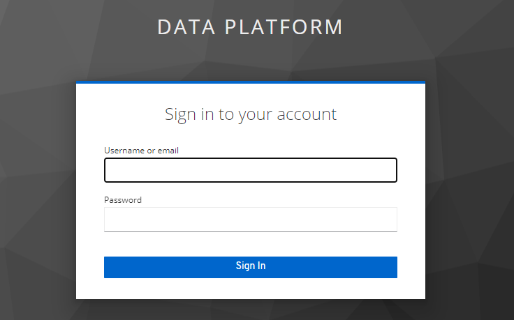

# Data Platform Foundation


## 0. Tooling

Eviden provides you some resources for this course 

**Eviden Codex Data Platform - Eviden CDP** is an open source data platform and we will use a sample of the platform to do the technical sessions


Most of the tools that we will use are linked in this portal : [https://portal.course.aiengineer.codex-platform.com/](https://portal.course.aiengineer.codex-platform.com/)

Let's focus on the main tools :

### 0.1 Kubeflow


[Kubeflow](https://www.kubeflow.org/) is an open-source end to end ML orchestration toolkit. Cloud Native, it handles most of the ML practice  / frameworks and allow to create strong and reliable workflows to operate the entire lifecycle of ML applications.

For this course, you will accès Kubeflow UI, and uses the Kubeflow API's remotly.

Our focus will be on Kubeflow's subparts :

- Notebooks, that will be your workspace for the course
- [Kubeflow pipelines](https://www.kubeflow.org/docs/components/pipelines/v1/introduction/) --> **KFP**, the orchestrator. It creates and links containers (called components) to create a workflow (called pipeline).
- [Kserve](https://github.com/kserve/kserve) the model serving tool. It creates api endpoint and make a ML model accessible and queryable behind it


### 1.0 Access Kubeflow UI

You will access the platform UI with this URL [portal.ai.course.aiengineer.codex-platform.com/](https://portal.ai.course.aiengineer.codex-platform.com/). You will access it thru a personal profile `firstname-lastname`.

Clicking on the link you should be redirected to `iam.course.aiengineer.codex-platform.com`, where the identities are managed. Here you have to log in using : 

```
username : firstname-lastname 
mp : firstname-lastname
```



Once you logged in, you will see Kubeflow home. Upper left your profile space (green on the screenshot), the **KFP - Kubeflow Pipeline** menu headings (red on the screenshot) and the **Model (Kserve)** menu heading (orange in the screenshot)


### 1.1 Create a Notebook server

Click on `Notebooks` menu and `New Notebook` button.

Name it`nameInitials-aiengineer-labs`  

```ex: John Doe --> jd-aiengineer-labs```


Set the CPU to `0.5` and the RAM to `1`


In the "configuration" step, **check the "allow accès to kubeflow pipeline" box**. Let the default values for the rest of the form.

Click on `Launch` at the bottom.


Wait until the notebook is marked with a green check and press `connect` button to open Jupyter Lab.


Then, clone the [https://github.com/A709509/aiengineerPolytech](hhttps://github.com/A709509/aiengineerPolytech) repo

```bash
git clone https://github.com/A709509/aiengineerPolytech
```

At this point, you will begin to write some code to interract with the platform.

**begin with the notebook** [0_data_get_analyse_and_ingest.ipynb](0_data_get_analyse_and_ingest.ipynb)

**For this notebook 0 you will need :**

- [https://min.io/docs/minio/linux/developers/python/API.html](https://min.io/docs/minio/linux/developers/python/API.html)
- [https://seaborn.pydata.org/](https://seaborn.pydata.org/)
- [https://pandas.pydata.org/docs/reference/index.html](https://pandas.pydata.org/docs/reference/index.html)

It will cover interactions between workspace and storage


**Once it's done and you learnt how to store data to minio, continue with**[1_empower_analysis_with_db_and_viz.ipynb](1_empower_analysis_with_db_and_viz.ipynb)

**For this notebook 1 you will need :**

 - [https://clickhouse.com/docs/en/sql-reference](https://clickhouse.com/docs/en/sql-reference)
 - [https://www.postgresql.org/docs/current/index.html](https://www.postgresql.org/docs/current/index.html)
 - [https://kafka-python.readthedocs.io/](https://kafka-python.readthedocs.io/)

 In this lab you will use different types of cold and hot storages. Also you will access an interface to vizualize data from those storages.